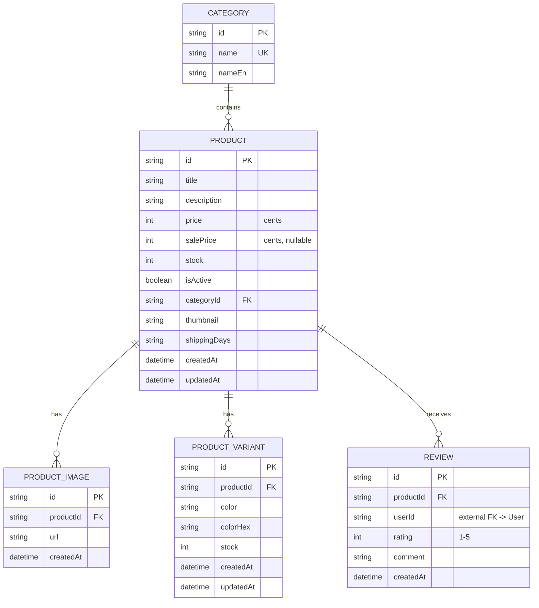

# Veritabanı Dokümantasyonu — `backend_nest` (Products Domain)

> **Kapsam notu:** Bu doküman `backend_nest/prisma/schema.prisma` dosyasını baz alır. Bu şema, paylaşılan Neon PostgreSQL veritabanının **sadece ürün (Product) alt kümesini** modeller. Aynı veritabanında `frontend_next/prisma/schema.prisma` tarafından yönetilen (User, Auth, Cart, Order, Wishlist, Coupon, CarouselItem, ProductTranslation vb.) çok daha geniş bir şema da vardır — migration'lar bu tarafından yönetilmez, sadece okunur/yazılır. Aşağıdaki her şey bu bilinçli sınırlama çerçevesinde değerlendirilmelidir.

---

## 1. Database Overview

`backend_nest`, ürün kataloğu için Next.js API route'larından tamamen bağımsız, ayrı bir REST servisidir. Aynı Postgres (Neon) veritabanına ikinci bir Prisma client ile bağlanır ve **migration sahibi değildir** — sadece var olan tabloları CRUD işlemleriyle kullanır.

**Veri modelinin merkezi:** `Product`. Etrafında üç adet 1-N (one-to-many) uydu tablo bulunur:

```
Category ──1:N──▶ Product ──1:N──▶ ProductImage
                     │
                     ├──1:N──▶ ProductVariant
                     └──1:N──▶ Review  (── userId ──▶ dış şemadaki User tablosu)
```

**Tipik veri akışı (bu servisin `/products` endpoint'i üzerinden):**
1. İstemci `GET /products?category=...&color=...&minPrice=...&rating=...` isteği atar.
2. `Category`/`ProductVariant`/`Review` tabloları üzerinden filtrelenmiş bir `Product` listesi (join'lerle birlikte) çekilir.
3. `Review` kayıtlarından anlık ortalama puan (`avgRating`) hesaplanır (denormalize bir kolon **yoktur**, bkz. §5.3).
4. Sonuç, sayfalama bilgisiyle (`hasMore`) birlikte döner.

**Para birimi:** `price` ve `salePrice` **kuruş/cent cinsinden `Int`** olarak saklanır — kayan noktalı sayı (float) yuvarlama hatalarından kaçınmak için doğru bir tasarım tercihi.

**Soft-delete deseni:** Ürünler `isActive: Boolean` bayrağıyla "pasif" hale getirilebilir (mağazadan gizlenir) ama servis ayrıca gerçek bir `DELETE /products/:id` (hard delete, `prisma.product.delete`) da sunar. Bu iki mekanizmanın bir arada bulunması bir tutarsızlık kaynağıdır — bkz. §5.4.

---

## 2. Model Detayları

### 2.1 `Category`

**Amaç:** Ürünleri gruplamak için basit bir taksonomi/kategori tablosu; TR/EN görünen ad desteği içerir.

| Alan | Tip | Null? | Varsayılan | Açıklama |
|---|---|---|---|---|
| `id` | `String` | Hayır | `cuid()` | Birincil anahtar (PK). |
| `name` | `String` | Hayır | — | Türkçe görünen ad. `@unique` — aynı isimde iki kategori olamaz. |
| `nameEn` | `String?` | Evet | `null` | İngilizce görünen ad (opsiyonel). |
| `products` | `Product[]` | — | — | Ters ilişki alanı (DB'de kolon değildir). |

**İlişkiler:** Bir `Category`, sıfır veya daha fazla `Product`'a sahip olabilir (1:N).

---

### 2.2 `Product` (merkezi entity)

**Amaç:** Satılabilir ürünü temsil eden ana katalog tablosu.

| Alan | Tip | Null? | Varsayılan | Kısıtlar / Açıklama |
|---|---|---|---|---|
| `id` | `String` | Hayır | `cuid()` | PK. |
| `title` | `String` | Hayır | — | Ürün başlığı. |
| `description` | `String?` | Evet | `null` | Ürün açıklaması. |
| `price` | `Int` | Hayır | — | **Kuruş cinsinden** fiyat (örn. 100 = 1.00₺). |
| `salePrice` | `Int?` | Evet | `null` | İndirimli fiyat (kuruş). `null` = indirim yok. |
| `stock` | `Int` | Hayır | `0` | Stok adedi. |
| `isActive` | `Boolean` | Hayır | `true` | Vitrinde görünürlük bayrağı (soft delete benzeri). |
| `categoryId` | `String?` | Evet | `null` | FK → `Category.id`. Ürün kategorisiz olabilir. |
| `category` | `Category?` | — | — | İlişki alanı. |
| `thumbnail` | `String?` | Evet | `null` | Ana/kapak görsel URL'i. |
| `images` | `ProductImage[]` | — | — | Ters ilişki — galeri görselleri. |
| `reviews` | `Review[]` | — | — | Ters ilişki — müşteri yorumları. |
| `variants` | `ProductVariant[]` | — | — | Ters ilişki — renk varyantları. |
| `shippingDays` | `String` | Hayır | `"3-5"` | Kargo süresi **serbest metin** olarak ("3-5" gibi bir aralık string'i). |
| `createdAt` | `DateTime` | Hayır | `now()` | Oluşturulma zamanı. |
| `updatedAt` | `DateTime` | Hayır | otomatik | `@updatedAt` — her güncellemede otomatik yenilenir. |

**İlişkiler:**
- `Category` ile **N:1** (opsiyonel) — her ürün en fazla bir kategoriye ait.
- `ProductImage`, `ProductVariant`, `Review` ile **1:N** — hepsi `onDelete: Cascade` (ürün silinirse bağlı kayıtlar da silinir).

---

### 2.3 `ProductImage`

**Amaç:** Ürünün `thumbnail` dışındaki ek galeri görselleri.

| Alan | Tip | Null? | Varsayılan | Açıklama |
|---|---|---|---|---|
| `id` | `String` | Hayır | `cuid()` | PK. |
| `productId` | `String` | Hayır | — | FK → `Product.id`. |
| `url` | `String` | Hayır | — | Görsel URL'i (Supabase storage). |
| `product` | `Product` | — | — | İlişki alanı. |
| `createdAt` | `DateTime` | Hayır | `now()` | — |

**İlişki:** `Product` ile **N:1**, `onDelete: Cascade`.

---

### 2.4 `ProductVariant`

**Amaç:** Ürünün renk bazlı varyantları — her rengin kendi stok sayısı ve isteğe bağlı kendi görselleri olabilir (SKU benzeri alt-birim).

| Alan | Tip | Null? | Varsayılan | Açıklama |
|---|---|---|---|---|
| `id` | `String` | Hayır | `cuid()` | PK. |
| `productId` | `String` | Hayır | — | FK → `Product.id`. |
| `color` | `String` | Hayır | — | **Serbest metin** renk adı (örn. "Siyah"). *Bkz. §5.1 — veri kalitesi sorunu.* |
| `colorHex` | `String?` | Evet | `null` | Renk kodu (örn. `#000000`), UI'da swatch göstermek için. |
| `stock` | `Int` | Hayır | `0` | Bu renk varyantının stok adedi. |
| `images` | `String[]` | Hayır | `[]` | Bu renge özel görsel URL'leri (Postgres text array). |
| `createdAt` / `updatedAt` | `DateTime` | Hayır | otomatik | — |

**İlişki:** `Product` ile **N:1**, `onDelete: Cascade`.

---

### 2.5 `Review`

**Amaç:** Müşteri ürün değerlendirmesi/puanı — ortalama puan hesaplamasının kaynağı.

| Alan | Tip | Null? | Varsayılan | Açıklama |
|---|---|---|---|---|
| `id` | `String` | Hayır | `cuid()` | PK. |
| `productId` | `String` | Hayır | — | FK → `Product.id`. |
| `userId` | `String` | Hayır | — | **Bu şemada tanımlı olmayan** `User` tablosuna işaret eden serbest scalar — bilinçli olarak auth modeline bağlanmadı (bkz. dosya başı not). |
| `rating` | `Int` | Hayır | — | 1-5 arası puan. **DB seviyesinde CHECK constraint yok**, sadece uygulama (DTO) seviyesinde doğrulanıyor. |
| `comment` | `String?` | Evet | `null` | Yorum metni. |
| `createdAt` | `DateTime` | Hayır | `now()` | — |

**Kısıt:** `@@unique([userId, productId])` — bir kullanıcı bir ürüne yalnızca bir kez yorum yapabilir.

**İlişki:** `Product` ile **N:1**, `onDelete: Cascade`. `userId` için bu şemada tanımlı bir Prisma ilişkisi **yoktur** (cross-schema referans).

---

## 3. İlişkilerin Sade Özeti

- **Category → Product**: Bir kategori birden çok ürüne sahip olabilir; bir ürün en fazla bir kategoriye aittir ya da hiçbirine ait değildir. *(1:N, opsiyonel)*
- **Product → ProductImage**: Bir ürünün birden çok galeri görseli olabilir; ürün silinirse görselleri de silinir. *(1:N, cascade)*
- **Product → ProductVariant**: Bir ürünün birden çok renk varyantı olabilir, her birinin kendi stoğu vardır; ürün silinirse varyantları da silinir. *(1:N, cascade)*
- **Product → Review**: Bir ürünün birden çok değerlendirmesi olabilir; her kullanıcı bir ürüne yalnızca bir kez yorum yapabilir; ürün silinirse yorumları da silinir. *(1:N, cascade + unique çift)*
- **Review → User (dış şema)**: `userId` başka bir şemanın sahip olduğu tabloya işaret eder; bu Prisma client'ı bunu bir ilişki olarak görmez, referans bütünlüğü (varsa) veritabanı seviyesinde `frontend_next` migration'ları tarafından sağlanır.

Bu daraltılmış şemada **many-to-many** ilişki yoktur (tam şemada örn. Wishlist/CarouselItem/Coupon gibi tablolar üzerinden olabilir, ama bu servis onları içermiyor).

---

## 4. Mermaid ER Diyagramı



---

## 5. İyileştirme Önerileri

### 5.1 İsimlendirme Standartları
- Model/tablo adları PascalCase-singular (`Product`, `ProductVariant`), alan adları camelCase — **zaten tutarlı**, korunmalı.
- `shippingDays: String` (`"3-5"` gibi) sorgulanabilir/sıralanabilir değil. Öneri: `shippingDaysMin: Int`, `shippingDaysMax: Int` şeklinde iki sayısal kolona bölünmesi.
- `ProductVariant.color` serbest metin olduğu için veri kalitesi sorunları zaten gözlemlendi (canlı veride "Bayaz"/"Beyaz", "Kırmkızı"/"Kırmızı" gibi yazım farklılıkları var). Öneri: ayrı bir `Color` lookup tablosu (`id`, `name`, `hex`) oluşturup `ProductVariant.colorId` ile referans vermek — hem yazım hatalarını engeller hem de renk filtreleme/istatistik tutarlılığını artırır.

### 5.2 Eksik İndeksler
Prisma, ilişki (foreign key) scalar alanları için **otomatik DB indeksi oluşturmaz** — açıkça `@@index` eklenmediği sürece. Şu an eksik olanlar:
- `Product.categoryId` → `@@index([categoryId])` (kategori filtresi her listelemede kullanılıyor).
- `Product.isActive` → neredeyse her sorgu `where isActive: true` içeriyor; `@@index([isActive, createdAt])` (varsayılan sıralamayla birlikte composite) önerilir.
- `ProductVariant.productId` ve `ProductVariant.color` → renk filtresi (`variants: { some: { color: ... } }`) sık kullanılıyor; `@@index([productId])` ve `@@index([color])` eklenmeli.
- `Review.productId` → puan ortalaması hesaplamak için (`groupBy`) her seferinde taranıyor; `@@index([productId])` şart.
- Case-insensitive eşleşmeler (`mode: "insensitive"` → Postgres `ILIKE`) normal B-tree indeksi verimli kullanamaz. `Category.nameEn` ve `ProductVariant.color` üzerinde sık insensitive arama yapılıyorsa, `citext` uzantısı veya `LOWER(...)` üzerinde fonksiyonel indeks düşünülmeli.

### 5.3 Performans
- Ortalama puan (`avgRating`) her `GET /products` çağrısında `Review` tablosundan **anlık hesaplanıyor** (groupBy/having). Küçük veri setinde sorun değil, ölçek büyüdükçe pahalılaşır. Öneri: `Product` üzerinde denormalize `avgRating`/`reviewCount` kolonları tutup, her `Review` create/update/delete işleminde güncellemek (trigger veya uygulama seviyesinde transaction ile).
- Sayfalama şu an **offset tabanlı** (`skip`/`take`). Küçük-orta veri setinde sorun yok, ama büyük `skip` değerlerinde (çok ileri sayfalar) Postgres yavaşlar. Katalog büyüdükçe **cursor-based pagination** (`createdAt` + `id` bileşik cursor) önerilir.
- `ProductVariant.images: String[]` sınırlı sayıda görsel için uygun; sıralama/alt-text gibi metadata ihtiyacı doğarsa ayrı bir tabloya (ProductImage'a benzer) taşınmalı.

### 5.4 Normalizasyon
- `color`/`colorHex` ayrı bir `Color` master tablosuna taşınmalı (bkz. §5.1).
- `Category.name`/`nameEn` şu an sabit iki kolon; tam şemadaki `ProductTranslation` desenine benzer bir `CategoryTranslation` tablosu, daha fazla dil eklenmesini kolaylaştırır.
- **Soft-delete (`isActive`) ile hard-delete (`DELETE /products/:id`) bir arada var** — bu iki mekanizmanın birlikte var olması kafa karıştırıcı ve tutarsızlık riski taşır (ör. bir ürün siparişlerde referans edilmişken hard-delete edilirse `OrderItem` gibi tam şemadaki tablolarla referans bütünlüğü bozulabilir — bu şemada `OrderItem` yok ama gerçek DB'de var). Öneri: `DELETE` endpoint'ini de `isActive: false` yapan bir soft-delete'e çevirmek, gerçek silmeyi ayrı ve korumalı bir "purge" işlemine bırakmak.

### 5.5 Güvenlik
- `Review.rating` için DB seviyesinde `CHECK (rating BETWEEN 1 AND 5)` **yok** — sadece Nest DTO validasyonu var. Aynı veritabanına başka bir servis/script doğrudan yazarsa bu kural atlanabilir. Defense-in-depth için DB seviyesinde CHECK constraint eklenmesi önerilir.
- `Product.salePrice < Product.price` kuralı da sadece konvansiyon; `CHECK (salePrice IS NULL OR salePrice < price)` eklenmesi veri tutarlılığını garanti eder.
- **(Bilinen ve kabul edilmiş durum)** `POST /products` ve `DELETE /products/:id` şu an **auth'suz** — bu bilinçli bir dev/öğrenme kararı olarak alındı, ama prod'a çıkmadan önce mutlaka bir auth guard (JWT/API key) eklenmelidir.
- CORS şu an tüm origin'lere açık (`app.enableCors()` varsayılanı) — dev için sorun değil, prod'da bilinen frontend origin'i ile sınırlandırılmalı.

### 5.6 Ölçeklenebilirlik
- İki ayrı Prisma client (`frontend_next` + `backend_nest`), aynı Neon endpoint'ine karşı ayrı `pg.Pool` bağlantı havuzları tutuyor. İkisi de büyüdükçe toplam bağlantı sayısının Neon'un bağlantı limitlerini aşmadığından emin olunmalı.
- `/products/filters` gibi nadiren değişen ama sık çağrılan meta veri (kategori/renk/fiyat aralığı) için bir cache katmanı (Redis veya basit in-memory TTL cache) düşünülebilir.
- **En büyük yapısal risk:** aynı `Product` alanı iki farklı Prisma şemasında (frontend_next ve backend_nest) bağımsız olarak tanımlı. `frontend_next` tarafında yeni bir migration (yeni kolon, yeni tablo) yapıldığında, bu servisin şemasının **elle senkronize edilmesi** gerekiyor — zamanla şema driftine (kayması) açık. Uzun vadede ya (a) tek bir "source of truth" şema paylaşılan bir pakette tutulmalı, ya da (b) Product domain sahipliği tamamen `backend_nest`'e taşınıp `frontend_next` sadece proxy yapmalı.

---

## 6. dbdiagram.io Formatı (DBML)

```dbml
Table Category {
  id String [pk, note: 'cuid()']
  name String [unique, not null, note: 'Türkçe görünen ad']
  nameEn String [note: 'İngilizce görünen ad, opsiyonel']
}

Table Product {
  id String [pk, note: 'cuid()']
  title String [not null]
  description String
  price Int [not null, note: 'kuruş cinsinden']
  salePrice Int [note: 'kuruş cinsinden, null = indirim yok']
  stock Int [not null, default: 0]
  isActive Boolean [not null, default: true]
  categoryId String [ref: > Category.id, note: 'opsiyonel']
  thumbnail String
  shippingDays String [not null, default: '3-5']
  createdAt DateTime [not null, default: `now()`]
  updatedAt DateTime [not null, note: '@updatedAt']
}

Table ProductImage {
  id String [pk, note: 'cuid()']
  productId String [not null, ref: > Product.id, note: 'onDelete: Cascade']
  url String [not null]
  createdAt DateTime [not null, default: `now()`]
}

Table ProductVariant {
  id String [pk, note: 'cuid()']
  productId String [not null, ref: > Product.id, note: 'onDelete: Cascade']
  color String [not null, note: 'serbest metin - bkz. öneriler']
  colorHex String
  stock Int [not null, default: 0]
  images "String[]" [note: 'Postgres text array']
  createdAt DateTime [not null, default: `now()`]
  updatedAt DateTime [not null]
}

Table Review {
  id String [pk, note: 'cuid()']
  productId String [not null, ref: > Product.id, note: 'onDelete: Cascade']
  userId String [not null, note: 'dış şema - User tablosu, bu Prisma clientta relation olarak tanımlı değil']
  rating Int [not null, note: '1-5, DB seviyesinde CHECK yok']
  comment String
  createdAt DateTime [not null, default: `now()`]

  indexes {
    (userId, productId) [unique]
  }
}
```

---

## 7. Açıklamalı Prisma Şeması

```prisma
// This is your Prisma schema file,
// learn more about it in the docs: https://pris.ly/d/prisma-schema

generator client {
  provider     = "prisma-client"
  output       = "../generated/prisma"
  moduleFormat = "cjs"
}

datasource db {
  provider = "postgresql"
}

// ============================================================================
// NOTE: This schema only models the subset of the shared database that this
// NestJS service needs (Product + its direct relations). Migrations for
// these tables are owned by `frontend_next/prisma/schema.prisma` — this app
// only reads/writes existing tables, it never runs `prisma migrate` itself.
// ============================================================================

/// Ürün kategorisi — basit taksonomi, TR/EN görünen ad destekler.
model Category {
  /// Birincil anahtar (cuid)
  id     String @id @default(cuid())
  /// Türkçe görünen ad — benzersiz olmalı
  name   String @unique
  /// İngilizce görünen ad (opsiyonel)
  nameEn String?
  /// Bu kategoriye ait ürünler (ters ilişki, kolon değildir)
  products Product[]
}

/// Satılabilir ürün — kataloğun merkezi entity'si.
model Product {
  /// Birincil anahtar (cuid)
  id           String           @id @default(cuid())
  /// Ürün başlığı
  title        String
  /// Ürün açıklaması (opsiyonel)
  description  String?
  /// Fiyat — KURUŞ cinsinden (float rounding hatalarından kaçınmak için Int)
  price        Int
  /// İndirimli fiyat — kuruş, null = indirim yok
  salePrice    Int?
  /// Stok adedi
  stock        Int              @default(0)
  /// Vitrinde görünürlük bayrağı (soft-delete benzeri, ama hard delete de mevcut — bkz. dokümantasyon §5.4)
  isActive     Boolean          @default(true)
  /// FK -> Category.id, opsiyonel (kategorisiz ürün olabilir)
  categoryId   String?
  category     Category?        @relation(fields: [categoryId], references: [id])
  /// Ana/kapak görsel URL'i
  thumbnail    String?
  /// Galeri görselleri (ters ilişki)
  images       ProductImage[]
  /// Müşteri yorumları (ters ilişki)
  reviews      Review[]
  /// Renk varyantları (ters ilişki)
  variants     ProductVariant[]
  /// Kargo süresi — serbest metin aralık (ör. "3-5"), sorgulanabilir değil
  shippingDays String           @default("3-5")
  createdAt    DateTime         @default(now())
  updatedAt    DateTime         @updatedAt
}

/// Ürünün ek galeri görselleri (thumbnail dışında).
model ProductImage {
  id        String   @id @default(cuid())
  /// FK -> Product.id, zorunlu
  productId String
  url       String
  product   Product  @relation(fields: [productId], references: [id], onDelete: Cascade)
  createdAt DateTime @default(now())
}

/// Ürünün renk bazlı varyantı — her rengin kendi stoğu ve isteğe bağlı görselleri.
model ProductVariant {
  id        String   @id @default(cuid())
  /// FK -> Product.id, zorunlu
  productId String
  product   Product  @relation(fields: [productId], references: [id], onDelete: Cascade)
  /// Renk adı — SERBEST METİN (öneri: ayrı Color tablosuna normalize edilmeli)
  color     String
  /// Renk kodu (swatch için), opsiyonel
  colorHex  String?
  /// Bu renk varyantının stok adedi
  stock     Int      @default(0)
  /// Bu renge özel görsel URL'leri
  images    String[]
  createdAt DateTime @default(now())
  updatedAt DateTime @updatedAt
}

/// Müşteri ürün değerlendirmesi/puanı.
model Review {
  id        String   @id @default(cuid())
  /// FK -> Product.id, zorunlu
  productId String
  /// Dış şemadaki User tablosuna işaret eder — bu Prisma client'ında relation olarak TANIMLI DEĞİL (bilinçli tercih)
  userId    String
  /// 1-5 arası puan — DB seviyesinde CHECK yok, sadece DTO validasyonu (öneri: CHECK constraint eklenmeli)
  rating    Int
  comment   String?
  product   Product  @relation(fields: [productId], references: [id], onDelete: Cascade)
  createdAt DateTime @default(now())

  /// Bir kullanıcı bir ürüne yalnızca bir kez yorum yapabilir
  @@unique([userId, productId])
}
```
