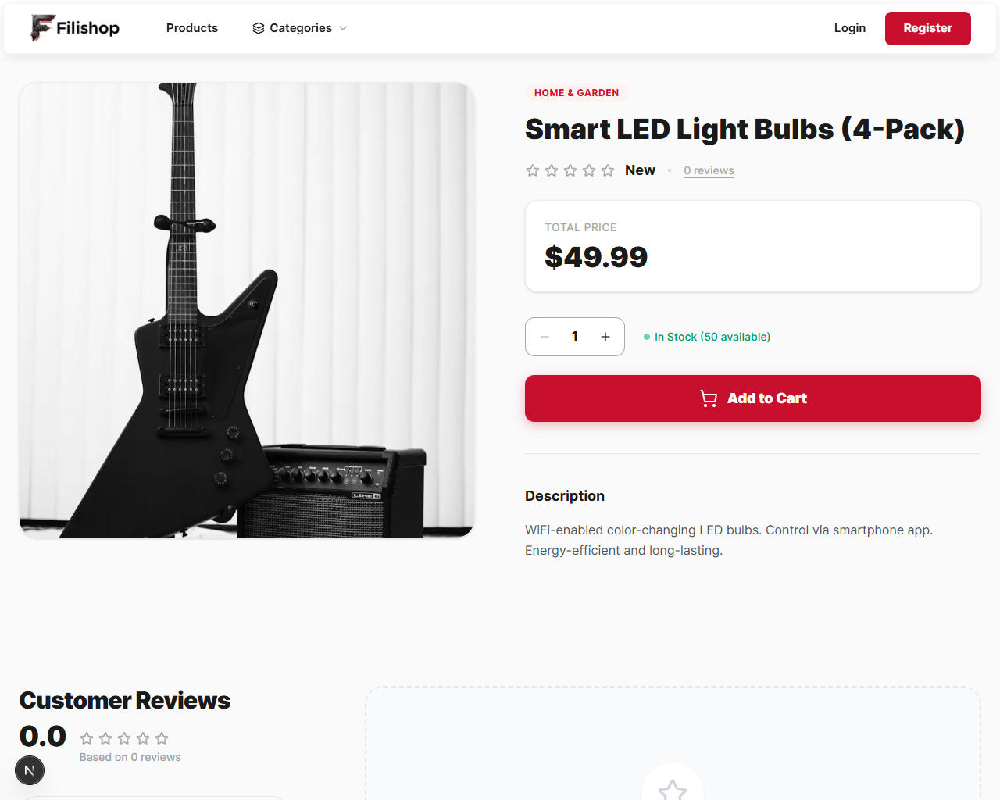
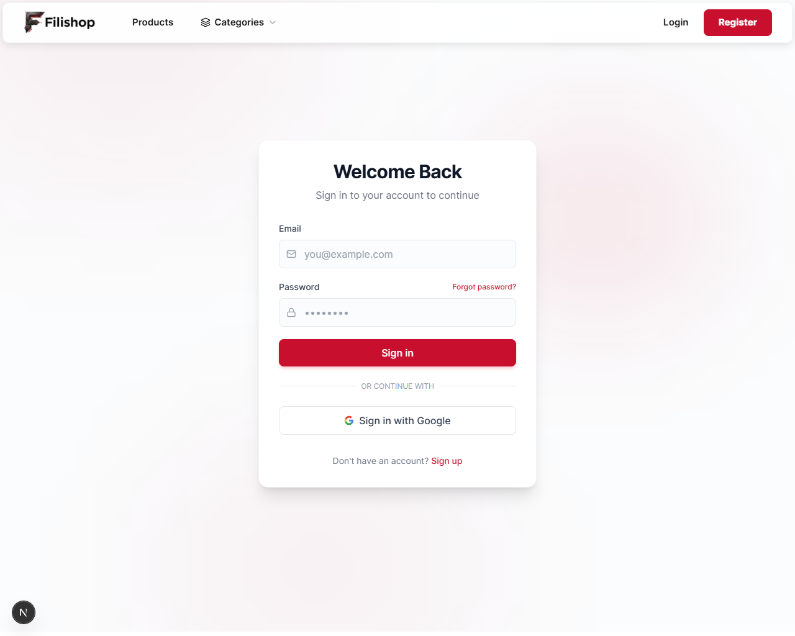

# Online Shop Kullanım Kılavuzu

Hoş geldiniz! Bu kılavuz, düzenlediğiniz online mağazayı nasıl kullanacağınız konusunda size adım adım rehberlik edecektir.

## 1. Ana Sayfa (Home)
Mağazanın giriş sayfasıdır. Burada vitrin ürünlerini, ana kategorileri ve öne çıkan kampanyaları görebilirsiniz. Üst menüyü kullanarak kategoriler arasında gezinebilir veya arama yapabilirsiniz.

---

## 2. Ürün Detay Sayfası
Bir ürüne tıkladığınızda bu sayfaya yönlendirilirsiniz.
* **Ürün Bilgileri:** Fiyat, açıklama ve stok durumu burada yer alır.
* **Sepete Ekle:** Ürünü satın almak için "Sepete Ekle" butonunu kullanabilirsiniz.

---

## 3. Sepetim (Cart)
Sepet ikonuna tıklayarak bu sayfaya ulaşabilirsiniz.
* Eklediğiniz ürünlerin listesini görebilirsiniz.
* Ürün adetlerini artırabilir veya azaltabilirsiniz.
* "Satın Al" veya "Ödeme Yap" butonu ile sipariş sürecini başlatabilirsiniz.

---

## 4. Giriş ve Üye Ol (Login/Register)
Sipariş takibi yapabilmek için giriş yapmanız önerilir.
* **Giriş Yap:** Mevcut hesabınızla giriş yapın.
* **Kayıt Ol:** Yeni bir hesap oluşturun.

---

**Not:** Bu kılavuz projenizdeki `public/docs/` klasörü altında oluşturulmuştur. Tarayıcınızda görüntüleyip "Yazdır > PDF Olarak Kaydet" seçeneği ile PDF formatına dönüştürebilirsiniz.
